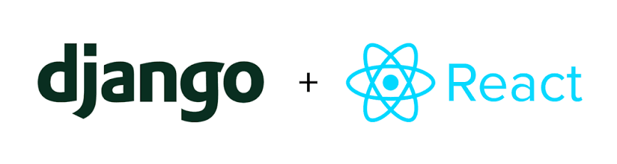
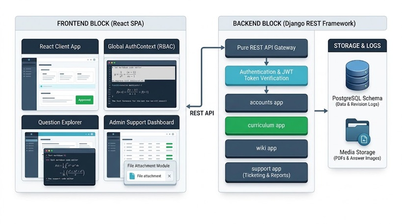
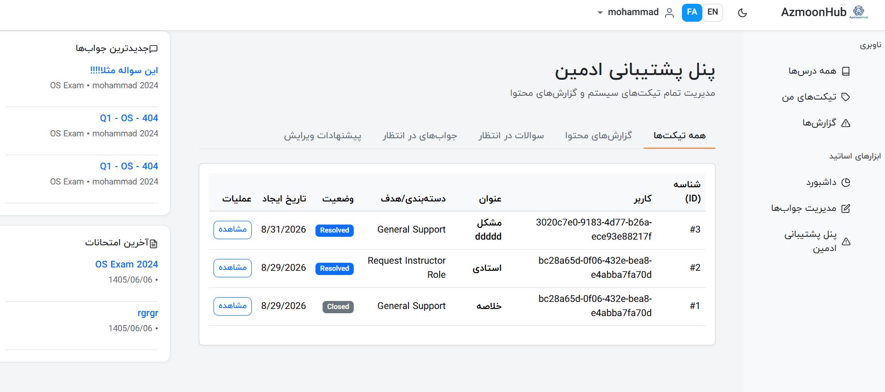
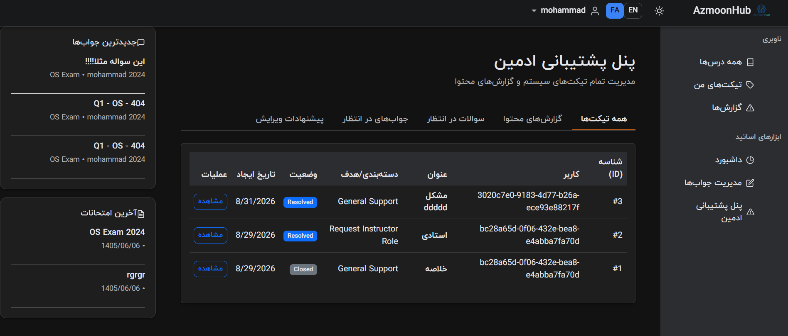
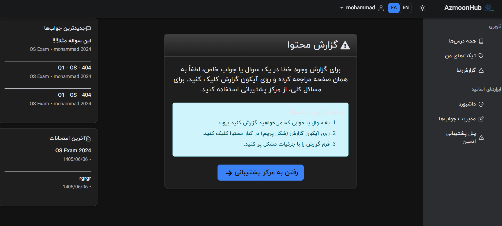
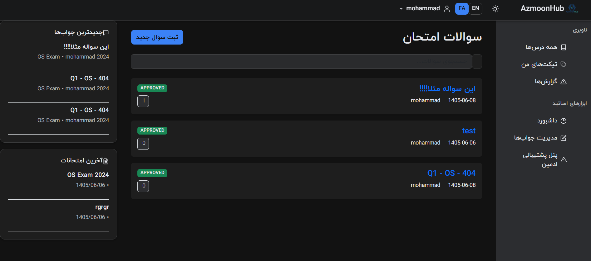
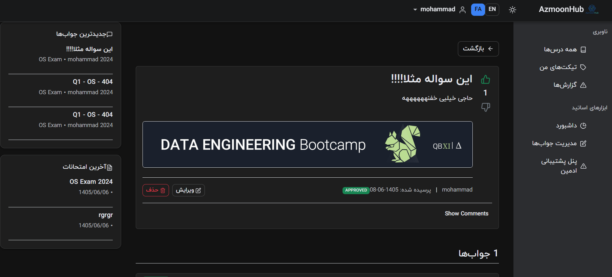
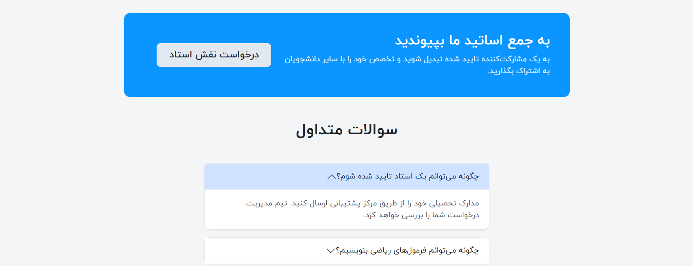

# UniQAKNTU (AzmoonHub Nasir): Instructor-Led Exam Q&A Platform

<div align="center">
  
</div>

<p align="center">
  
  
  
  
</p>

## Overview

**UniQAKNTU** (also known as *AzmoonHub Nasir*) is a modern, crowdsourced open exam wiki and collaborative learning platform engineered specifically for university examinations at K. N. Toosi University of Technology. The platform bridges the gap between students and educators by providing a centralized repository for verified exam solutions, past papers, and structured academic discussions.

The system features a fully decoupled monorepo architecture uniting a high-performance Django REST Framework backend with a responsive, internationalized React Single Page Application (SPA). The foundational architecture, core API bridging, and the initial scalable decouple strategy were conceptualized and designed by Mohammad Amin Haji Alirezaei, establishing the strict operational guidelines for the application's lifecycle.

---

## System Architecture & Security

<div align="center">
  
</div>

The platform operates on a robust client-server model heavily fortified by strict **Role-Based Access Control (RBAC)**:

* **Backend (Django REST Framework):** Manages relational data models, high-speed caching/session workflows (Redis), and strict permission classes. It utilizes JWT authentication with refresh token rotation.
* **Frontend (React & Vite):** Delivers a fluid user experience with state-managed API consumption, dual Dark/Light mode styling, and seamless i18n support for both English (LTR) and Persian/Farsi (RTL).
* **Advanced Rate Limiting:** Registration, login, and email change workflows are protected by brute-force countermeasures, enforcing temporary 15-minute IP/Username lockouts after 5 consecutive failed attempts.

---

## Core Platform Capabilities

### 1. Unified Authentication & Identity Management
Registration strictly requires automatic 6-digit OTP email verification before account activation. Users can manage security settings, reset passwords, and securely change authenticated email addresses through a secondary OTP verification flow.

<div align="center">
  
</div>

### 2. Source Material & Exam Explorer
Course resources are hierarchically organized into `SourceMaterials`. Students and instructors can easily browse by year, access official downloadable exam and solution PDFs, and navigate directly into isolated question explorers for specific past papers.

<div align="center">
  
</div>

### 3. Advanced Wiki Collaboration & MathJax
Questions and answers support rich-text Markdown formatting natively integrated with **MathJax** for precise scientific notation (supporting both inline `$E=mc^2$` and block equations). 
* **Infrastructure-Agnostic Attachments:** The platform utilizes an *Orphan Claiming* pattern. Media files are uploaded asynchronously and embedded using relative database paths (`attachments/filename.png`), ensuring full portability between local development and cloud S3 buckets without breaking historical markdown data.

<div align="center">
  
</div>

### 4. Support Center & Helpdesk Ticketing
A comprehensive built-in support module enables users to raise tracking tickets across distinct categories (General Support, Technical Issues, Content Errors, and Instructor Role Requests). The ticketing system includes a chronological live chat interface for direct communication with the admin team.

<div align="center">
  
</div>

### 5. Multi-Tier Moderation & Admin Operations
The system safely isolates student read-only/suggestion workflows from instructor write privileges.
* **Direct Operations:** Moderators and Admins bypass the standard pending queue and can directly create, update, or hard-delete content. 
* **Official Content:** Instructors can flag solutions with `is_official`. The backend automatically prioritizes these verified responses at the top of the UI rendering tree.
* **User Management:** An exclusive Admin-only dashboard provides full oversight of registered users, including live role modification capabilities.

<div align="center">
  
</div>

### 6. Threaded Discussions & Instructor Dashboards
UniQAKNTU supports rich community interaction through upvoting and threaded comments.
* **Smart Discussions:** Comments support 1-level deep threading. 
* **Soft Deletion:** If a user deletes a parent comment, the system performs a soft-delete—preserving the child replies while masking the original author and replacing the text with a `[Deleted]` placeholder.

<div align="center">
  
</div>

---

## Project Structure

```text
UniQAKNTU/
│
├── backend/                  # Django REST Framework Backend
│   ├── apps/
│   │   ├── accounts/         # RBAC, User Models, OTP, Role Requests
│   │   ├── curriculum/       # Course, Source Material, and Exam Hierarchy
│   │   ├── wiki/             # Questions, Answers, Comments, and Voting
│   │   └── support/          # Ticketing, Content Reports, and Suggested Edits
│   ├── config/               # Core Django Settings & API URL Routing
│   ├── media/                # Server Storage for Uploaded PDFs and Images
│   ├── manage.py
│   └── requirements.txt      # Python Dependencies
│
├── frontend/                 # React SPA Frontend
│   ├── public/
│   ├── src/
│   │   ├── components/       # Reusable UI (Navbar, MarkdownEditor, Cards)
│   │   ├── context/          # Global Auth (JWT) & Source Material State
│   │   ├── pages/            # View Containers (Dashboards, Auth, Profiles)
│   │   ├── locales/          # i18n Translation Files (English & Persian)
│   │   └── App.jsx           # Main Router Configuration
│   ├── package.json          # Node Dependencies
│   └── vite.config.js        # Vite Build & Proxy Configuration
│
└── documentations/           # File-Centric Technical Documentation
    ├── imgs/                 # Architecture, Flow, and UI Screenshots (1-6.png)
    └── ...

```

---

## Local Development & Setup

### Prerequisites

* Python 3.10+
* Node.js & npm
* PostgreSQL & Redis

### 1. Backend Initialization (Django)

```bash
cd backend
python -m venv venv
source venv/bin/activate  # On Windows use: venv\Scripts\activate
pip install -r requirements.txt
python manage.py makemigrations
python manage.py migrate
python manage.py runserver 0.0.0.0:8000

```


### 2. Frontend Initialization (React)

```bash
cd frontend
npm install
npm run dev

```

---

## Development Team & Acknowledgments

* **Supervising Professor:** Dr. Hamed Khanmirza
* **Core Architecture & Frontend Developer:** Mohammad Amin Haji Alirezaei
* **Backend Developer:** Mohammad Sajjad Hamidifard
* **Institution:** K. N. Toosi University of Technology

```
